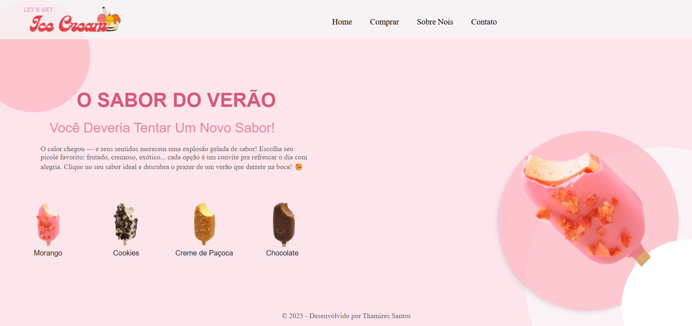

# Loja de Picolés 🍦

Bem-vindo à Loja de Picolés! Este é um website interativo e simples, criado para demonstrar algumas interações de UI/UX inspiradas em um design que encontrei.

---

## Índice

* [Sobre o Projeto](#sobre-o-projeto)
* [Tecnologias Utilizadas](#tecnologias-utilizadas)
* [Funcionalidades](#funcionalidades)
* [Como Usar](#como-usar)
* [Contato](#contato)

---

## Sobre o Projeto

A Loja de Picolés é um projeto de front-end que simula uma interface de uma loja de doces. A principal funcionalidade é a interação visual: ao clicar em diferentes picolés apresentados na página, o site altera dinamicamente as cores e estilos de certos elementos, criando uma experiência interativa e visualmente agradável.

Este projeto foi desenvolvido como parte do meu processo de estudo e aprimoramento de habilidades em HTML, CSS e JavaScript. Ele foi inspirado por um design de UI que encontrei no Pinterest e pode ser visto <a href= "https://youtu.be/BYXO6Ei_fzI?si=4trdgp-yfU3liSu-">aqui </a>. Embora eu tenha tentado reproduzir o máximo possível, algumas funcionalidades específicas do design original não foram implementadas. O foco principal foi na manipulação do DOM com JavaScript para alterações visuais em tempo real.

---

## Tecnologias Utilizadas

Este projeto foi construído puramente com tecnologias web front-end:

* **HTML:** Para a estrutura e conteúdo da página.
* **CSS:** Para a estilização e responsividade.
* **JavaScript:** Para a lógica interativa de mudança de cor e estilo.

---

## Funcionalidades

* **Seleção de Picolé Interativa:** Clique em qualquer picolé para ver a página mudar cores e estilos.
* **Design Responsivo:** Adaptado para telas menores.

---

## Como Usar

É muito simples! Como este é um projeto de front-end puro, você não precisa de nenhuma instalação ou configuração especial.

1.  **Acesse o link do site:** (https://thamiresantos.github.io/popsicle-shop/)
2.  **Explore:** Clique nos diferentes picolés e veja a mágica acontecer!

---

## Contato
* [Github](https://github.com/thamiresantos)
* [Instagram](https://www.instagram.com/codewiththa/)
* [Linkedin](https://www.linkedin.com/in/thamires-santos-a9a652263) 
  
